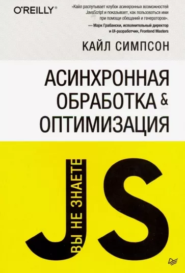

## My library

This is where I keep my book list
- [Programming](https://github.com/artyomSultanov/artyomSultanov/blob/main/library/README.md#programming)
  - [JavaScript](https://github.com/artyomSultanov/artyomSultanov/blob/main/library/README.md#-javascript)
  - [TypeScript](https://github.com/artyomSultanov/artyomSultanov/blob/main/library/README.md#-typescript)
  - [React](https://github.com/artyomSultanov/artyomSultanov/blob/main/library/README.md#-react)
  - [Express](https://github.com/artyomSultanov/artyomSultanov/blob/main/library/README.md#-express)
- [Algorithms and Data Structures](https://github.com/artyomSultanov/artyomSultanov/blob/main/library/README.md#algorithms%and%data%structures)

---

### Programming
#### &nbsp; JavaScript
| Cover | Title | Status |
| :---: | --- | :---: |
|  | Выразительный JavaScript | **Completed** |
|  | JavaScript. Полное руководство | **In Progress** |
|  | JavaScript для профессионалов | **Planned** |
|  | Вы не знаете JS | **Planned** |
#### &nbsp; TypeScript
| Cover | Title | Status |
| :---: | --- | :---: |
|  | TypeScript быстро | **Completed** |
|  | Профессиональный TypeScript | **Planned** |
#### &nbsp; React
| Cover | Title | Status |
| :---: | --- | :---: |
|  | React. Современные шаблоны разработки приложений | **Completed** |
#### &nbsp; Express
| Cover | Title | Status |
| :---: | --- | :---: |
|  | Веб-разработка с применением Node и Express | **Completed** |

---

### Algorithms and Data Structures
| Cover | Title | Status |
| :---: | --- | :---: |
|  | Грокаем алгоритмы | **Completed** |
|  | Алгоритмы. Построение и анализ | **Planned** |
