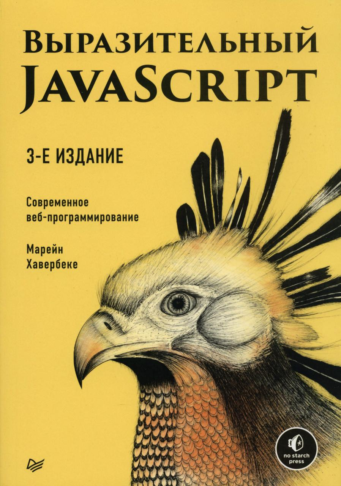
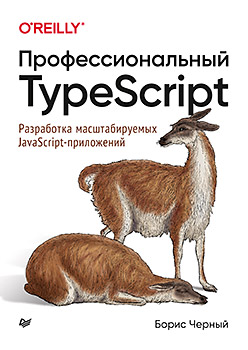
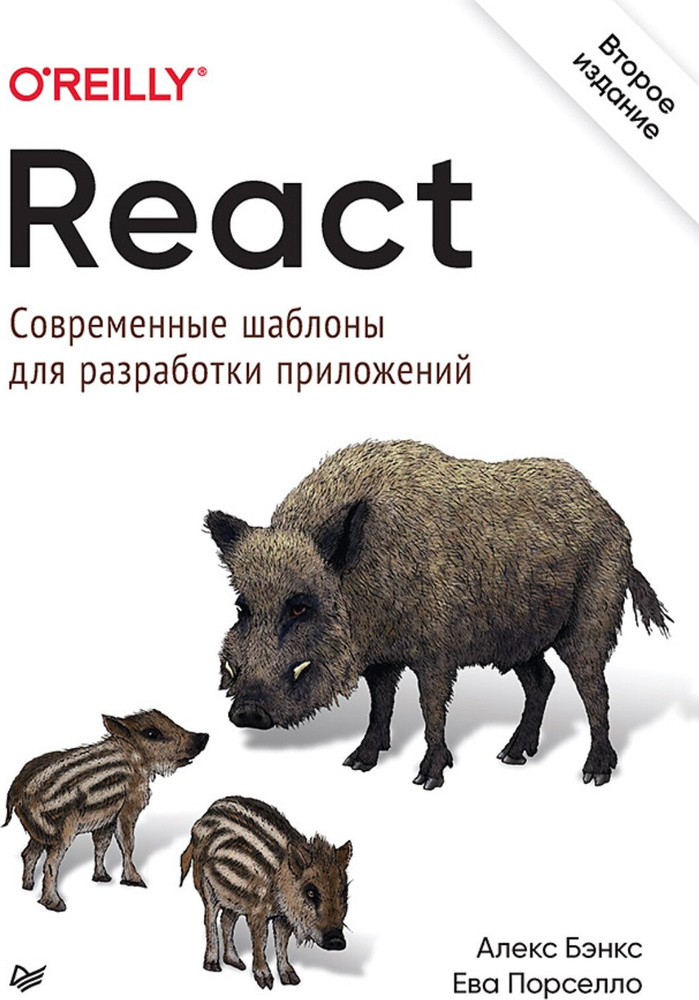
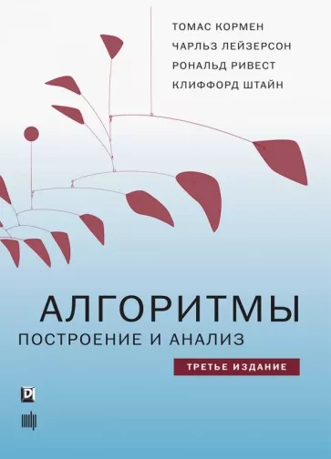

### My library

This is where I keep my book list

---

### Programming

#### JavaScript
| Cover | Title | Status |
| :---: | --- | :---: |
|  | Выразительный JavaScript | **Completed** |
|  | JavaScript. Полное руководство | **In Progress** |
|  | JavaScript для профессионалов | **To To** |
|  | Вы не знаете JS | **To Do** |

#### TypeScript
| Cover | Title | Status |
| :---: | --- | :---: |
|  | TypeScript быстро | **Completed** |
|  | Профессиональный TypeScript | **To Do** |

#### React
| Cover | Title | Status |
| :---: | --- | :---: |
|  | React. Современные шаблоны разработки приложений | **Completed** |

#### Express
| Cover | Title | Status |
| :---: | --- | :---: |
|  | Веб-разработка с применением Node и Express | **Completed** |

---

### Algorithms and Data Structures
| Cover | Title | Status |
| :---: | --- | :---: |
|  | Грокаем алгоритмы | **Completed** |
|  | Алгоритмы. Построение и анализ | **To Do** |
